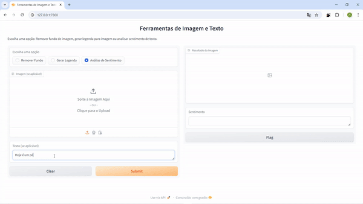

# Projeto de Desenvolvimento de Aplicações com Hugging Face

Este projeto demonstra como utilizar a biblioteca Hugging Face e outras ferramentas para desenvolver uma aplicação interativa que oferece três funcionalidades: remoção de fundo de imagens, geração de legendas para imagens e análise de sentimentos de texto.



## Funcionalidades

### 1. Remoção de Fundo de Imagens

Esta funcionalidade permite remover o fundo de uma imagem, isolando o objeto principal. É útil para edição de imagens e design gráfico.

### 2. Geração de Legendas para Imagens

A aplicação gera descrições automáticas para imagens, o que pode ser útil para acessibilidade e para fornecer contexto visual.

### 3. Análise de Sentimentos

A análise de sentimentos classifica um texto em sentimentos positivos, negativos ou neutros, ajudando a entender a opinião expressa em feedbacks e comentários.

## Como Funciona

A aplicação utiliza a biblioteca Gradio para criar uma interface interativa. O usuário pode escolher entre as três opções disponíveis e fornecer uma imagem ou texto conforme necessário. O sistema processa a entrada e retorna o resultado apropriado.

## Instalação

Para instalar as dependências necessárias, execute:

```bash
pip install transformers torch pillow gradio pysentimiento
